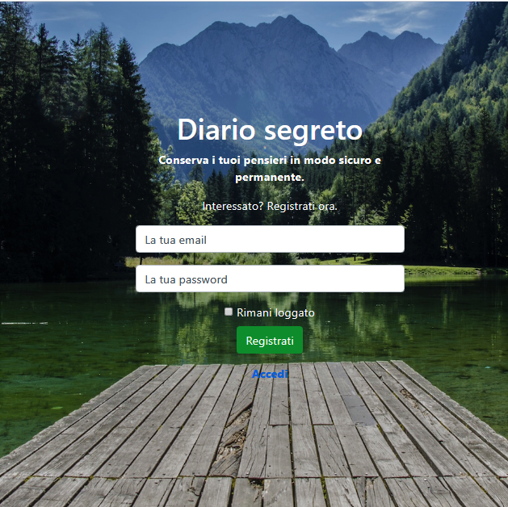
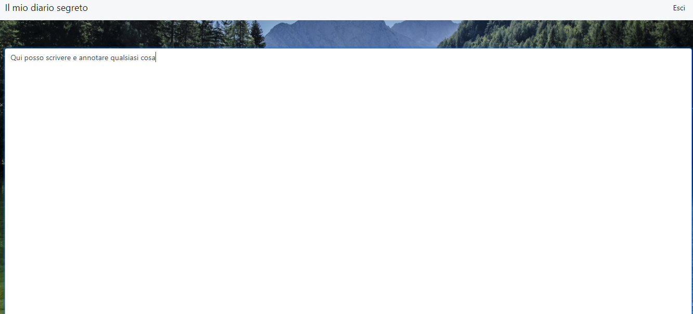

# Secret-Diary

### Project developed in: php, html, css, bootstrap, JQuery and Mysql. 

*This project allows **registration or login** via a form, immediately after the user can enter information in a text area that is automatically stored in a **MySql database**.*

#### Page Log in

#### Page Sign Up

#### Logged page 

### Create a database
*To use this project you need to create a database. See the **diario_segreto.sql** file in the code. Good luck !*
